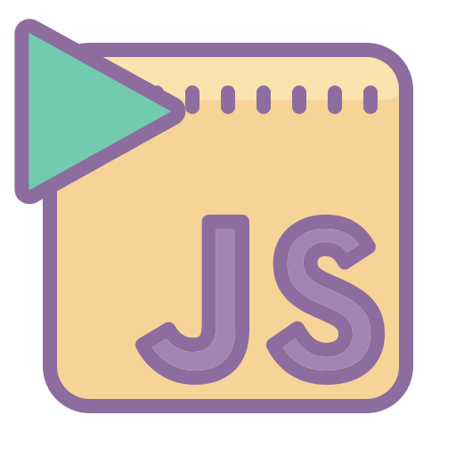

<div align="center">
    
    <h1>EvalJS</h1>
    <p>
        <b>Tiny bot allowing JS execution via Slack</b>
    </p>
    <p>
        
        
        
        
        
        
    </p>
    <br>
    <br>
    <br>
</div>

> WARNING: This is not for any production use whatsoever. This bot uses eval(), which is highly unsafe. Although Deno has a sandbox and the code tries to prevent accessing the `Deno` object, you should still run this on an isolated VM. The author disclaims any liability, see LICENSE

## Running

```bash
deno run --allow-net index.ts
```

## Supporters

[](https://github.com/KhushrajRathod/EvalJS/stargazers)

[](https://github.com/KhushrajRathod/EvalJS/network/members)

## Related

- [Slack Info Bot](https://github.com/KhushrajRathod/SlackInfoBot)
- [Deno Slack SDK](https://github.com/slack-deno/deno-slack-sdk)
- [Deno modules](https://github.com/KhushrajRathod/DenoModules)
